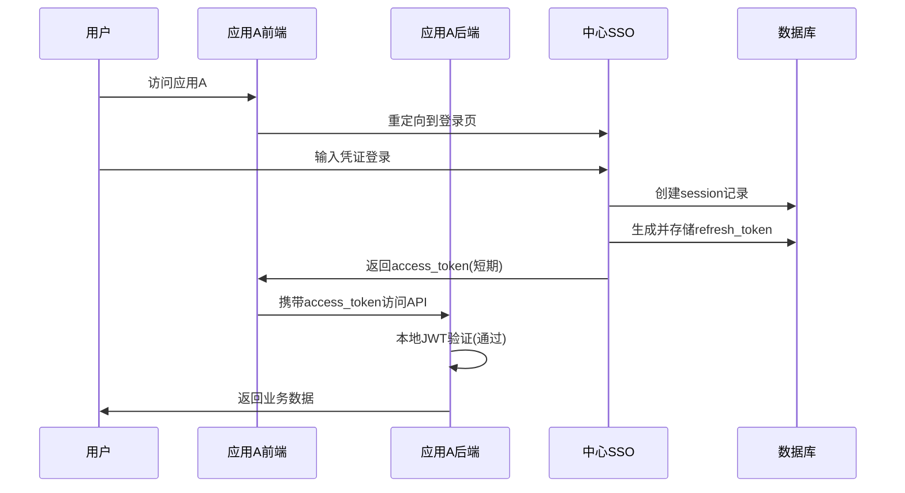
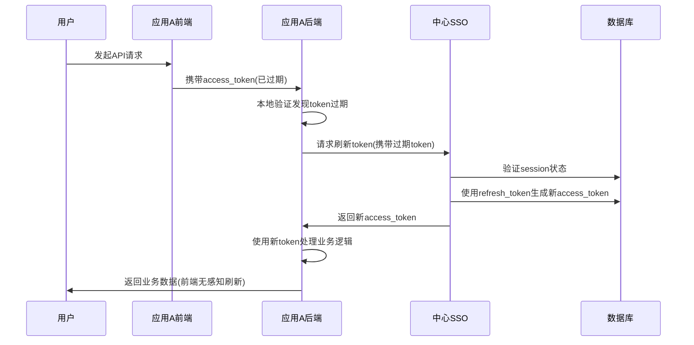
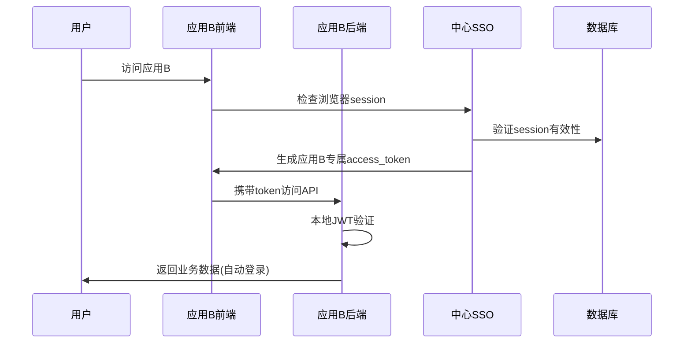

# 中心化SSO登录系统架构设计文档（后端Refresh Token方案）

## 📋 文档信息
- **文档版本**: v2.0
- **创建日期**: 2024年1月15日
- **最后更新**: 2024年1月15日
- **作者**: AI架构助手
- **状态**: 定稿

## 🎯 架构核心原则

### **安全第一原则**
- 🔒 **Refresh Token永不离开后端**
- 🔐 **前端只接触短期Access Token**
- 🛡️ **中心化会话管理**
- 📊 **完整的审计日志**

## 🏗️ 优化后的系统架构

```
┌─────────────┐    ┌─────────────┐    ┌─────────────┐
│   应用A     │    │ 中心SSO系统  │    │   应用B     │
│  前端       │    │             │    │  前端       │
│  ┌───────┐  │    │  ┌───────┐  │    │  ┌───────┐  │
│  │Access │  │    │  │登录页 │  │    │  │Access │  │
│  │Token  │◄─┼────┼──│面    │  │    │  │Token  │  │
│  └───────┘  │    │  └───────┘  │    │  └───────┘  │
└─────────────┘    │             │    └─────────────┘
                   │  ┌───────┐  │
┌─────────────┐    │  │Token  │  │    ┌─────────────┐
│   应用A     │    │  │刷新服务│  │    │   应用B     │
│  后端       │────┼──►       │◄─┼────│  后端       │
│  ┌───────┐  │    │  └───────┘  │    │  ┌───────┐  │
│  │Auth   │  │    │  ┌───────┐  │    │  │Auth   │  │
│  │中间件  │  │    │  │Session│  │    │  │中间件  │  │
│  └───────┘  │    │  │管理    │  │    │  └───────┘  │
└─────────────┘    │  └───────┘  │    └─────────────┘
                   └─────────────┘
                               │
                     ┌─────────┴─────────┐
                     │    数据存储层       │
                     │  ┌─────────────┐  │
                     │  │  sessions   │  │
                     │  │    表       │  │
                     │  └─────────────┘  │
                     └───────────────────┘
```

## 🔄 核心流程设计

### **1. 首次登录流程**


### **2. Token自动刷新流程**


### **3. SSO流程（应用B）**


## 💾 简化的数据库设计

### **核心表：sessions（会话管理）**
```sql
CREATE TABLE sessions (
    -- 主键标识
    id BIGSERIAL PRIMARY KEY,
    session_id VARCHAR(128) UNIQUE NOT NULL,
    user_id VARCHAR(64) NOT NULL,
    
    -- Token管理（哈希存储）
    current_access_token_hash VARCHAR(256),
    refresh_token_hash VARCHAR(256) NOT NULL,
    
    -- 状态管理
    status VARCHAR(20) DEFAULT 'active',
    created_at TIMESTAMPTZ DEFAULT NOW(),
    expires_at TIMESTAMPTZ NOT NULL,
    last_activity TIMESTAMPTZ DEFAULT NOW(),
    last_refresh_at TIMESTAMPTZ,
    
    -- 安全信息
    user_agent TEXT,
    ip_address INET,
    device_fingerprint VARCHAR(128),
    
    -- 应用上下文
    current_app_id VARCHAR(64),
    
    -- 索引优化
    INDEX idx_sessions_user (user_id),
    INDEX idx_sessions_expiry (expires_at),
    INDEX idx_sessions_activity (last_activity),
    INDEX idx_sessions_status (status)
);
```

### **辅助表：token_refresh_logs（审计日志）**
```sql
CREATE TABLE token_refresh_logs (
    id BIGSERIAL PRIMARY KEY,
    session_id VARCHAR(128) NOT NULL,
    user_id VARCHAR(64) NOT NULL,
    app_id VARCHAR(64) NOT NULL,
    old_token_hash VARCHAR(256),
    new_token_hash VARCHAR(256),
    refreshed_at TIMESTAMPTZ DEFAULT NOW(),
    user_agent TEXT,
    ip_address INET,
    success BOOLEAN NOT NULL,
    error_reason VARCHAR(64),
    
    INDEX idx_refresh_logs_session (session_id),
    INDEX idx_refresh_logs_user (user_id),
    INDEX idx_refresh_logs_time (refreshed_at)
);
```

## 🔧 核心组件实现

### **1. 中心SSO服务 - Token刷新服务**
```python
class CentralTokenRefreshService:
    async def refresh_access_token(self, expired_token: str, app_id: str, 
                                 request_metadata: dict) -> dict:
        """
        中心化token刷新 - 后端调用
        """
        try:
            # 1. 解析过期token获取session_id（忽略过期）
            session_id = self.decode_session_id_ignore_expiry(expired_token)
            if not session_id:
                return self.error_response("invalid_token")
            
            # 2. 单次查询获取完整会话信息
            session = await self.get_session_with_validation(session_id)
            if not session:
                return self.error_response("session_invalid")
            
            # 3. 安全检查
            security_check = await self.security_validation(session, request_metadata)
            if not security_check["passed"]:
                await self.handle_security_incident(session, security_check["reason"])
                return self.error_response("security_validation_failed")
            
            # 4. 滑动续签检查
            await self.sliding_renewal_check(session)
            
            # 5. 生成新token
            new_token = await self.generate_new_access_token(session, app_id)
            
            # 6. 更新会话记录
            await self.update_session_tokens(session, new_token)
            
            # 7. 记录审计日志
            await self.log_refresh_operation(session, app_id, request_metadata)
            
            return {
                "success": True,
                "access_token": new_token,
                "expires_in": config.ACCESS_TOKEN_EXPIRY,
                "token_type": "Bearer"
            }
            
        except Exception as e:
            logger.error(f"Token refresh error: {e}")
            return self.error_response("server_error")
    
    async def get_session_with_validation(self, session_id: str):
        """单次查询完成所有验证"""
        session = await self.db.fetch_one("""
            SELECT s.*, u.status as user_status, u.login_count
            FROM sessions s 
            JOIN users u ON s.user_id = u.user_id
            WHERE s.session_id = $1 
            AND s.status = 'active'
            AND s.expires_at > NOW()
            AND u.status = 'active'
        """, session_id)
        return session
```

### **2. 子应用后端 - 统一认证中间件**
```python
class SSOAuthMiddleware:
    """子应用后端认证中间件"""
    
    def __init__(self, app, sso_client):
        self.app = app
        self.sso_client = sso_client
        
    async def __call__(self, scope, receive, send):
        if scope["type"] != "http":
            return await self.app(scope, receive, send)
        
        request = Request(scope, receive)
        
        # 跳过公开端点
        if self.is_public_endpoint(request):
            return await self.app(scope, receive, send)
        
        # 提取token
        access_token = self.extract_access_token(request)
        if not access_token:
            return await self.unauthorized_response(send, "missing_token")
        
        # 验证token
        auth_result = await self.authenticate_request(access_token, request)
        
        if auth_result["authenticated"]:
            # 认证成功，继续处理
            return await self.proceed_with_authentication(
                scope, receive, send, auth_result
            )
        else:
            # 认证失败
            return await self.handle_authentication_failure(send, auth_result)
    
    async def authenticate_request(self, access_token: str, request: Request) -> dict:
        """认证请求"""
        try:
            # 1. 本地快速JWT验证
            validation = self.validate_token_locally(access_token)
            
            if validation["valid"]:
                return {
                    "authenticated": True,
                    "user_info": validation["payload"],
                    "needs_refresh": False
                }
            elif validation["expired"]:
                # 2. Token过期，尝试刷新
                return await self.handle_token_refresh(access_token, request)
            else:
                return {
                    "authenticated": False,
                    "error": "token_invalid",
                    "message": "Token validation failed"
                }
                
        except Exception as e:
            logger.error(f"Authentication error: {e}")
            return {
                "authenticated": False,
                "error": "authentication_error",
                "message": str(e)
            }
    
    async def handle_token_refresh(self, expired_token: str, request: Request) -> dict:
        """处理token刷新"""
        refresh_result = await self.sso_client.refresh_token(
            expired_token=expired_token,
            app_id=self.app_id,
            user_agent=request.headers.get("user-agent"),
            ip_address=self.get_client_ip(request)
        )
        
        if refresh_result["success"]:
            # 刷新成功，更新请求中的token
            new_token = refresh_result["access_token"]
            user_info = self.decode_token(new_token)
            
            return {
                "authenticated": True,
                "user_info": user_info,
                "needs_refresh": True,
                "new_token": new_token
            }
        else:
            return {
                "authenticated": False,
                "error": "token_refresh_failed",
                "message": refresh_result.get("error", "Refresh failed")
            }
```

### **3. 安全监控服务**
```python
class SecurityMonitor:
    """安全监控和异常检测"""
    
    async def validate_refresh_request(self, session: dict, request_metadata: dict) -> dict:
        """验证刷新请求的安全性"""
        checks = {
            "device_consistency": await self.check_device_consistency(session, request_metadata),
            "refresh_frequency": await self.check_refresh_frequency(session),
            "geolocation_consistency": await self.check_geolocation_consistency(session, request_metadata),
            "user_agent_analysis": await self.analyze_user_agent(session, request_metadata)
        }
        
        passed = all(checks.values())
        risk_score = self.calculate_risk_score(checks)
        
        return {
            "passed": passed,
            "risk_score": risk_score,
            "details": checks
        }
    
    async def check_refresh_frequency(self, session: dict) -> bool:
        """检查刷新频率"""
        recent_refreshes = await self.db.fetch_val("""
            SELECT COUNT(*) FROM token_refresh_logs 
            WHERE session_id = $1 
            AND refreshed_at > NOW() - INTERVAL '1 hour'
        """, session["session_id"])
        
        return recent_refreshes < config.MAX_HOURLY_REFRESHES
```

## 🌐 API接口规范

### **中心SSO系统API**
```http
# 1. Token刷新接口（后端调用）
POST /api/v1/token/refresh
Content-Type: application/json
X-App-ID: your_app_id
X-App-Secret: your_app_secret

{
  "expired_token": "eyJ...",
  "user_agent": "Mozilla/5.0...",
  "ip_address": "192.168.1.100"
}

响应：
{
  "success": true,
  "access_token": "new_jwt_token",
  "expires_in": 3600,
  "token_type": "Bearer"
}

# 2. 会话验证接口
POST /api/v1/session/validate
Content-Type: application/json

{
  "session_id": "session_abc",
  "app_id": "app_a"
}

# 3. 用户登出接口
POST /api/v1/session/logout
Content-Type: application/json

{
  "session_id": "session_abc",
  "logout_type": "global"  // or "single"
}
```

## ⚡ 性能优化策略

### **1. 缓存策略**
```python
class TokenValidationCache:
    """Token验证缓存"""
    
    def __init__(self, redis_client):
        self.redis = redis_client
        self.cache_ttl = 300  # 5分钟
    
    async def get_cached_validation(self, token_hash: str) -> Optional[dict]:
        """获取缓存验证结果"""
        cached = await self.redis.get(f"token_valid:{token_hash}")
        return json.loads(cached) if cached else None
    
    async def cache_validation_result(self, token_hash: str, result: dict):
        """缓存验证结果"""
        await self.redis.setex(
            f"token_valid:{token_hash}",
            self.cache_ttl,
            json.dumps(result)
        )
```

### **2. 数据库查询优化**
```sql
-- 使用覆盖索引减少回表
CREATE INDEX idx_sessions_validation ON sessions 
(session_id, status, expires_at, user_id) 
INCLUDE (current_access_token_hash, refresh_token_hash);
```

## 🚀 部署和扩展性

### **微服务架构部署**
```yaml
# docker-compose.prod.yml
version: '3.8'
services:
  sso-api:
    image: sso-center:latest
    deploy:
      replicas: 3
    environment:
      - DB_URL=postgresql://user:pass@db:5432/sso
      - REDIS_URL=redis://redis:6379
      - JWT_PUBLIC_KEY=/run/secrets/jwt_public
    secrets:
      - jwt_private
      - jwt_public
  
  sso-gateway:
    image: nginx:alpine
    ports:
      - "443:443"
    configs:
      - source: nginx.conf
        target: /etc/nginx/nginx.conf

configs:
  nginx.conf:
    file: ./config/nginx.conf

secrets:
  jwt_private:
    file: ./secrets/jwt_private.pem
  jwt_public:
    file: ./secrets/jwt_public.pem
```

## 📊 监控指标

### **关键性能指标**
```python
# Prometheus指标定义
SSO_METRICS = {
    "sso_token_validations_total": "Token验证总次数",
    "sso_token_refreshes_total": "Token刷新总次数", 
    "sso_refresh_success_rate": "刷新成功率",
    "sso_session_duration_seconds": "会话持续时间",
    "sso_active_sessions": "活跃会话数",
    "sso_security_incidents_total": "安全事件数"
}
```

## ✅ 架构优势总结

### **安全性优势**
- ✅ **Refresh Token后端安全存储**
- ✅ **前端无敏感信息泄露风险**
- ✅ **中心化安全策略执行**
- ✅ **完整的审计日志**

### **性能优势**
- ✅ **本地JWT验证减少网络开销**
- ✅ **单次数据库查询完成刷新**
- ✅ **缓存优化提升响应速度**

### **运维优势**
- ✅ **统一的安全监控**
- ✅ **简化的数据库结构**
- ✅ **易于扩展和维护**

这个架构既保证了安全性，又提供了良好的性能和可维护性。Refresh Token完全由后端管理，前端只处理短期有效的Access Token，符合企业级安全要求。