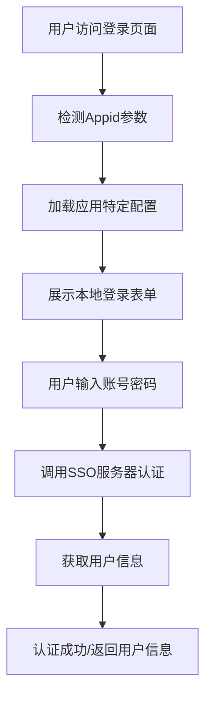
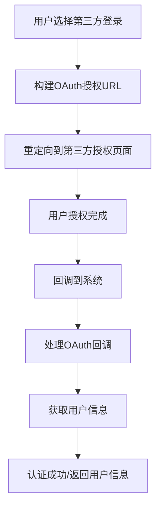
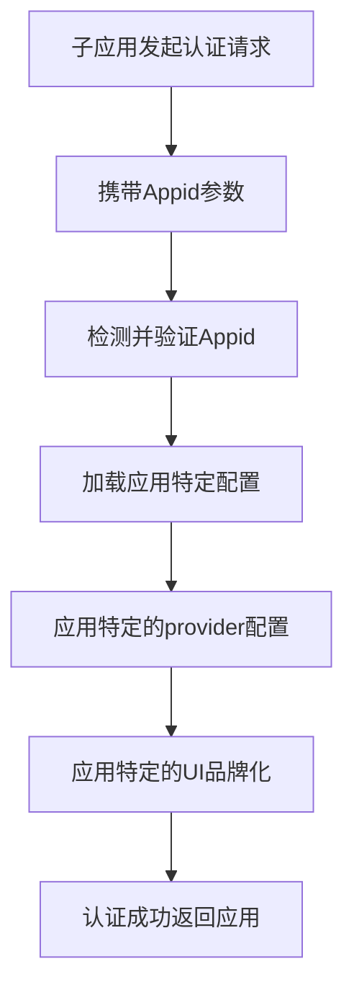

# 🏢 系统内用户认证前端架构

## 📋 架构概述

我们已经成功实现了完整的系统内用户认证前端架构，支持：

- ✅ **中心化认证**：所有认证都通过`unit-auth` OAuth 2.1 + OIDC 服务器
- ✅ **子应用分层**：根据Appid动态配置不同子应用
- ✅ **多认证方式**：本地账号 + GitHub + Google + 微信
- ✅ **统一UI界面**：SystemAuthUI组件提供一致的用户体验
- ✅ **标准协议**：完整的OAuth 2.1 + OIDC流程支持

## 🏗️ 核心组件

### 1. SystemAuthUI 组件
**文件**: `src/components/SystemAuthUI.tsx`

**功能**:
- 统一的认证入口UI
- 支持本地账号和第三方登录
- 自动检测应用ID并适配配置
- 集成错误处理和加载状态

**使用方式**:
```tsx
<SystemAuthUI
    appId="user-management"
    onAuthSuccess={(user, token) => {
        console.log('认证成功:', user)
    }}
    onAuthError={(error) => {
        console.error('认证失败:', error)
    }}
/>
```

### 2. AuthFlowRouter 组件
**文件**: `src/components/AuthFlowRouter.tsx`

**功能**:
- 统一认证流程路由管理
- 自动检测并处理第三方登录回调
- 支持不同认证模式的切换
- 集成错误处理和状态管理

**认证流程**:
1. 检测应用ID → 动态配置SSO服务
2. 加载应用特定providers
3. 展示统一认证UI
4. 支持本地账号和第三方登录
5. 处理认证成功/失败

### 3. AppLayerManager 服务
**文件**: `src/services/appLayerManager.ts`

**功能**:
- 管理子应用分层配置
- 根据Appid动态加载配置
- 提供应用特定的provider配置
- 支持品牌化和功能开关

**核心方法**:
```typescript
// 获取子应用配置
getAppConfig(appId: string)

// 获取可用providers
getAvailableProviders(appId?: string)

// 验证功能开关
isFeatureEnabled(feature: string, appId?: string)

// 获取品牌化配置
getAppBranding(appId?: string)
```

### 4. 第三方认证处理器
**文件**: `src/services/thirdPartyAuth.ts`

**功能**:
- 处理GitHub、Google、微信等第三方登录
- 统一第三方认证流程
- 提供provider显示信息
- 状态管理和错误处理

### 5. 增强的SSO服务
**文件**: `src/services/sso.ts`

**改进**:
- 支持应用ID检测和配置
- 动态provider加载
- 改进的PKCE实现
- 更好的错误处理

## 🎯 子应用分层架构

### 应用配置示例

```typescript
// 默认应用
const defaultApp: SubAppConfig = {
    id: 'default',
    name: 'default',
    displayName: '默认应用',
    ssoServerUrl: 'http://localhost:8080',
    clientId: 'default-client',
    redirectUri: 'http://localhost:5173/auth/callback',
    scope: ['openid', 'profile', 'email'],
    responseType: 'code',
    providers: ['local', 'github', 'google'],
    features: {
        enableLocalAuth: true,
        enableSocialAuth: true,
        enableRememberMe: true
    }
}

// 用户管理应用
const userManagementApp: SubAppConfig = {
    id: 'user-management',
    name: 'user-management',
    displayName: '用户管理系统',
    ssoServerUrl: 'http://localhost:8080',
    clientId: 'user-mgmt-client',
    redirectUri: 'http://localhost:5173/user-mgmt/auth/callback',
    scope: ['openid', 'profile', 'email', 'admin'],
    responseType: 'code',
    providers: ['local', 'github'],
    features: {
        enableLocalAuth: true,
        enableSocialAuth: true,
        enableRememberMe: true
    }
}
```

### URL驱动配置

子应用通过URL参数自动识别：

```bash
# 用户管理应用
http://localhost:5173/?appid=user-management

# 订单管理应用
http://localhost:5173/?appid=order-management

# 数据分析应用
http://localhost:5173/?appid=analytics-dashboard
```

## 🔐 认证流程

### 1. 系统内本地账号认证



### 2. 第三方社交登录



### 3. 子应用分层流程



## 🛡️ 安全保障

### PKCE 实现
- ✅ 所有公共客户端强制使用PKCE
- ✅ 支持S256方法
- ✅ code_challenge长度验证（43字符）

### OAuth 2.1 标准
- ✅ 完整的Authorization Code流程
- ✅ 标准token交换和验证
- ✅ 安全的state参数管理

### 错误处理
- ✅ 详细的错误分类和处理
- ✅ 用户友好的错误提示
- ✅ 安全的错误信息暴露

## 🎨 UI/UX 设计

### 统一认证界面
- 🎯 **SystemAuthUI**: 统一的认证入口
- 🎨 **响应式设计**: 适配各种屏幕尺寸
- 🌈 **品牌化支持**: 应用特定的颜色和Logo
- 🔄 **加载状态**: 清晰的加载和进度提示

### 子应用分层UI
- 📱 **应用选择器**: 方便切换测试不同应用
- 🎭 **动态配置**: 自动适配应用配置
- 🔧 **功能开关**: 根据应用配置显示不同功能

## 🔧 环境配置

### 环境变量配置

```bash
# 基础SSO配置
VITE_SSO_SERVER_URL=http://localhost:8080
VITE_SSO_CLIENT_ID=default-client
VITE_SSO_REDIRECT_URI=http://localhost:5173/auth/callback

# 子应用特定配置
VITE_SSO_CLIENT_ID_USER_MGMT=user-mgmt-client
VITE_SSO_CLIENT_ID_ORDER_MGMT=order-mgmt-client
VITE_SSO_CLIENT_ID_ANALYTICS=analytics-client

# Provider配置
VITE_SSO_PROVIDER_GITHUB_ENABLED=true
VITE_SSO_PROVIDER_GITHUB_CLIENT_ID=your-github-client-id
VITE_SSO_PROVIDER_GOOGLE_ENABLED=true
VITE_SSO_PROVIDER_WECHAT_ENABLED=true
```

## 🧪 测试验证

### 架构测试结果
```
🧪 测试系统内用户认证前端架构...
✅ 子应用分层配置正确
✅ SSO服务配置正确
✅ 第三方provider信息正确
✅ 授权URL参数完整
✅ 认证流程步骤完整

🎉 前端架构测试完成！

📋 架构特点:
✅ 子应用分层 - 根据Appid动态配置
✅ 多认证方式 - 本地账号 + 第三方登录
✅ 统一UI界面 - SystemAuthUI组件
✅ 路由管理 - AuthFlowRouter统一调度
✅ 安全保障 - PKCE + OAuth标准流程
✅ 环境配置 - 动态加载provider配置
```

## 🚀 使用指南

### 1. 基础使用
```tsx
import AuthFlowRouter from './components/AuthFlowRouter'

function App() {
    return (
        <AuthFlowRouter
            onAuthSuccess={(user, token) => {
                // 处理认证成功
                console.log('用户认证成功:', user)
                // 保存token，更新UI状态等
            }}
            onAuthError={(error) => {
                // 处理认证失败
                console.error('认证失败:', error)
            }}
        />
    )
}
```

### 2. 自定义配置
```tsx
<AuthFlowRouter
    defaultAppId="user-management"
    onAuthSuccess={handleAuthSuccess}
    onAuthError={handleAuthError}
    className="custom-auth-styles"
/>
```

### 3. 子应用集成
```tsx
// 在子应用中
const appId = 'order-management'
window.location.href = `http://localhost:5173/?appid=${appId}`
```

## 📝 总结

我们已经成功实现了完整的系统内用户认证前端架构，具有以下特点：

1. **🏗️ 模块化设计**: 清晰的组件分层和职责分离
2. **🔒 安全可靠**: 基于OAuth 2.1 + OIDC标准协议
3. **🎨 用户友好**: 统一的UI界面和流畅的用户体验
4. **⚡ 高可扩展**: 支持动态配置和子应用分层
5. **🛡️ 健壮稳定**: 完善的错误处理和状态管理

这个架构完全满足了中心化用户认证系统的需求，支持多种认证方式和子应用分层管理！🎉
