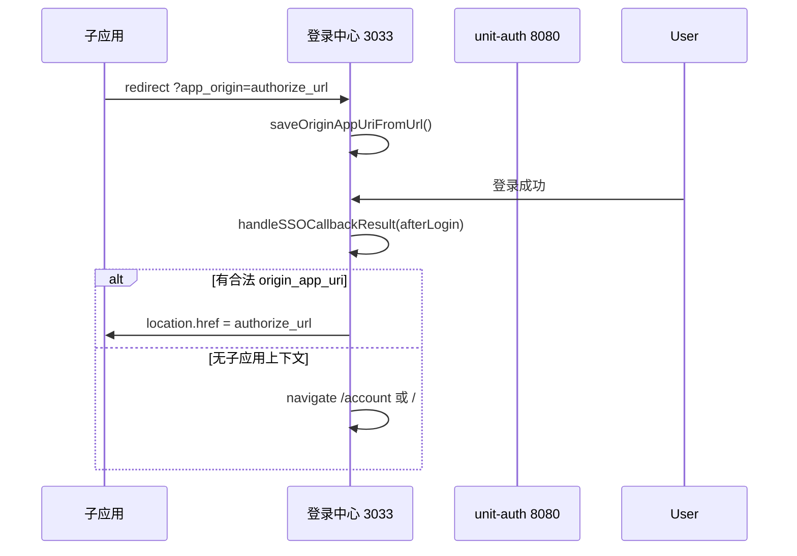

# 用户账户中心（登录后个人页）需求文档

> 版本：v0.2  
> 范围：`Packages/Login/web`（3033 登录中心）登录成功后的「查看 / 配置个人信息」  
> 关联后端：`Packages/Login/unit-auth`  
> 状态：需求已评审 · 技术方案分析中

---

## 1. 背景与目标

### 1.1 现状

当前登录成功页（`LoginPage`）仅展示：

- 「已登录」+ 昵称
- 子项目场景下的「继续前往应用」
- 「退出登录」

用户**无法在登录中心查看完整资料、修改资料、管理安全项**。  
而 unit-auth 已具备部分用户 API，前端 `userApi` / `useAuth.updateProfile` 也有封装，但**未形成独立页面与信息架构**。

### 1.2 产品定位

本页面是 **IdP（身份提供方）账户中心**，不是业务子应用（如 Words-V2）内的「学习设置」。

| 维度 | 账户中心（本文） | 子应用内设置 |
|------|------------------|--------------|
| 账号归属 | 全局唯一 SSO 账号 | 项目内偏好 |
| 典型内容 | 头像、昵称、密码、第三方绑定 | 课程进度、主题、通知 |
| 数据主库 | `unit_auth.users` | 各业务库 |

### 1.3 目标

1. 用户登录后可**查看**自己的账号全貌（只读 + 可编辑分区清晰）。
2. 用户可**安全地修改**允许自助变更的字段。
3. 与 OIDC `profile` / `email` scope 对齐，子应用通过 token/userinfo 消费一致数据。
4. 为后续「设备管理、登录活动、应用授权」留扩展位。

### 1.4 非目标（首期不做）

- 管理员能力（已在 `admin-web`）
- 子应用业务配置（词汇书、学习计划等）
- 完整 IAM / RBAC 自助申请
- 企业级 SCIM 用户自助开通

---

## 2. 业界通用需求参考

综合 OAuth/OIDC 账户中心、Google Account、GitHub Settings、Auth0 User Profile、Notion/Linear 等产品的共性：

### 2.1 OIDC / SSO 标准侧

OpenID Connect 的 `profile`、`email`、`phone` scope 通常覆盖：

| Claim | 含义 | 账户中心是否展示 |
|-------|------|------------------|
| `sub` | 用户唯一 ID | 是（只读，可复制） |
| `preferred_username` / `name` | 用户名 / 显示名 | 是 |
| `email` + `email_verified` | 邮箱及验证状态 | 是 |
| `phone_number` + `phone_number_verified` | 手机及验证状态 | 是 |
| `picture` | 头像 | 是 |
| `updated_at` | 资料更新时间 | 可选 |

IdP 账户中心还需承担：**凭据管理**（密码）、**联合身份**（Google/GitHub/微信绑定）、**会话/设备**、**登出所有设备**。

### 2.2 安全与合规共性

- 修改邮箱/手机：**验证码二次确认**
- 修改密码：**旧密码 + 新密码强度校验**
- 敏感操作：**重新认证**（近期登录或再次输入密码）
- 注销账号：**明确后果说明 + 密码确认 + 冷静期**（可选）
- 登录活动：**时间、IP、设备、结果**（至少只读）
- 隐私：**展示哪些应用可读到哪些字段**（OAuth 授权记录，可二期）

### 2.3 体验共性

- **左侧导航 + 右侧内容**（桌面）；移动端 **底部 Tab / 折叠菜单**
- **资料页**：头像区 + 基础信息表单
- **安全页**：密码、绑定、会话
- **账号页**：ID、注册时间、注销
- 保存：**分区块保存**或统一保存；脏数据离开前提示
- 子项目回跳：保留顶部 **「返回应用」** 横幅（与现 `app_origin` 逻辑一致）

---

## 3. 用户角色与场景

| 角色 | 场景 |
|------|------|
| 普通用户 | 登录后查看/改昵称、头像、简介 |
| 邮箱/手机用户 | 改密、绑定/换绑联系方式 |
| 第三方登录用户 | 查看已绑定 GitHub/Google/微信，补设密码 |
| 子项目跳转用户 | 从 `app_id` 跳转来，改完资料后回子应用 |
| 仅本地开发用户 | 无子项目上下文时，账户中心即主页 |

---

## 4. 信息架构（建议页面结构）

```
/account  （或登录态下 LoginPage 二级路由）
├── 概览 Dashboard        # 摘要卡片：头像、昵称、最近登录
├── 个人资料 Profile      # 可编辑资料
├── 账号与安全 Security   # 密码、绑定、验证状态
├── 登录活动 Activity     # 本人登录日志（二期）
├── 已授权应用 Apps       # OAuth 客户端授权（二期）
└── 账户注销 Danger Zone  # 注销说明与操作
```

**首期 MVP 建议只做 3 个 Tab：**

1. **个人资料**（Profile）
2. **账号与安全**（Security）
3. **概览**（可选，或与 Profile 合并为单页上下分区）

---

## 5. 功能需求明细

### 5.1 个人资料（Profile）

| 编号 | 需求 | 优先级 | 说明 |
|------|------|--------|------|
| P-01 | 展示用户头像 | P0 | 来自 `meta.avatar` 或 Gravatar/默认字母头像 |
| P-02 | 上传/更换头像 | P1 | 前端已有 `uploadAvatar` API 封装，**后端路由待实现** |
| P-03 | 展示用户名 | P0 | `username`，一般**不可改**或改一次（需后端策略） |
| P-04 | 展示/编辑昵称 | P0 | 对应 `nickname`，已支持 `PUT /profile` |
| P-05 | 展示/编辑简介等扩展信息 | P1 | `meta.bio`、`location`、`website` 等 |
| P-06 | 展示邮箱 + 验证徽章 | P0 | 只读展示 `email_verified` |
| P-07 | 展示手机 + 验证徽章 | P0 | 只读展示 `phone_verified` |
| P-08 | 展示账号 ID | P1 | `id` 只读，支持一键复制（联调/客服） |
| P-09 | 展示注册时间、最近登录 | P1 | `created_at`、`last_login_at`、`login_count` |
| P-10 | 表单校验与错误提示 | P0 | 昵称长度、meta 字段格式 |
| P-11 | 保存成功/失败反馈 | P0 | Toast + 同步 `UserStore` |

**字段编辑权限建议：**

| 字段 | 用户可改 | 备注 |
|------|----------|------|
| nickname | 是 | 已实现 |
| meta.* | 是 | 已实现（PUT meta） |
| username | **是** | 唯一性校验；改后同步子项目（M4） |
| email | 否（首期直改） | 走「换绑流程」见 S-04 |
| phone | 否（首期直改） | 走「换绑流程」见 S-05 |

### 5.2 账号与安全（Security）

| 编号 | 需求 | 优先级 | 说明 |
|------|------|--------|------|
| S-01 | 修改密码 | P0 | `POST /api/v1/user/change-password`，需旧密码 |
| S-02 | 密码强度提示 | P0 | 最少 8 位、含数字/字母等（与注册一致） |
| S-03 | 第三方账号绑定状态 | P0 | 展示 Google / GitHub / 微信是否已绑定（读 `google_id` 等，**接口需脱敏**） |
| S-04 | 绑定/解绑第三方 | P1 | 走 OAuth 授权回调，**后端 API 待设计** |
| S-05 | 换绑邮箱 | P2 | 新邮箱验证码 + 旧邮箱确认 |
| S-06 | 换绑手机 | P2 | 短信验证码 |
| S-07 | 纯 OAuth 用户「设置密码」 | P1 | 无本地密码时允许首次设置，便于备用登录 |
| S-08 | 退出当前设备 | P0 | 复用 `ssoLogout` / 本地 logout |
| S-09 | 退出所有设备 | P2 | 吊销全部 refresh token + 销毁 SSO session |
| S-10 | 两步验证（2FA） | P3 | 可选，与 IdP 策略一致 |

### 5.3 登录活动（Activity）— 二期

| 编号 | 需求 | 优先级 | 说明 |
|------|------|--------|------|
| A-01 | 查看本人最近登录记录 | P2 | 数据在 `login_logs`，**现仅 admin API** |
| A-02 | 展示 IP、时间、方式、成功/失败 | P2 | provider: local/github/google/wechat |
| A-03 | 异常登录提示 | P3 | 新设备/新地区 |

**需新增 API：** `GET /api/v1/user/login-logs?page=&page_size=`

### 5.4 已授权应用（Apps）— 二期

| 编号 | 需求 | 优先级 | 说明 |
|------|------|--------|------|
| O-01 | 列出已授权 SSO 客户端 | P2 | 基于 session / token 记录 |
| O-02 | 撤销单个应用授权 | P2 | 销毁对应 session |

### 5.5 账户注销（Danger Zone）

| 编号 | 需求 | 优先级 | 说明 |
|------|------|--------|------|
| D-01 | 注销说明与后果 | P1 | 数据删除范围、子项目影响 |
| D-02 | 密码确认后注销 | P1 | 前端有 `deleteAccount`，**后端路由待实现** |
| D-03 | 软删除 + 冷静期 | P2 | 与 `users.deleted_at` 一致 |

### 5.6 与子项目 SSO 的衔接

| 编号 | 需求 | 优先级 | 说明 |
|------|------|--------|------|
| L-01 | 保留「继续前往应用」 | P0 | `app_origin` / `redirect_uri` 存在时顶部固定 |
| L-02 | 资料变更后 userinfo 一致 | P0 | 子应用下次 refresh/userinfo 拿到新数据 |
| L-03 | 项目映射同步 | P1 | 后端 `UpdateProfile` 已向已配置 project 推送 |

---

## 6. 与现有系统能力对照

### 6.1 后端 unit-auth（已有）

| API | 状态 | 用于 |
|-----|------|------|
| `GET /api/v1/user/profile` | 已有 | 资料展示 |
| `PUT /api/v1/user/profile` | 已有（nickname + meta） | 资料编辑 |
| `POST /api/v1/user/change-password` | 已有 | 改密 |
| `GET /api/v1/auth/oauth/userinfo` | 已有 | OIDC 标准 claims |
| `login_logs` 表 | 已有 | 仅 admin 查询 |
| 用户 `meta` JSON | 已有 | 头像、简介等 |
| 第三方 ID 字段 | 已有 | google_id / github_id / wechat_id |

### 6.2 后端缺口（需排期）

| 能力 | 前端是否已写 | 建议 API |
|------|--------------|----------|
| 头像上传 | `userApi.uploadAvatar` | `POST /api/v1/user/avatar` |
| 账户注销 | `userApi.deleteAccount` | `POST /api/v1/user/delete-account` |
| 第三方绑定列表（脱敏） | 无 | `GET /api/v1/user/linked-accounts` |
| 绑定/解绑 OAuth | 无 | `POST/DELETE .../linked-accounts/:provider` |
| 本人登录日志 | 无 | `GET /api/v1/user/login-logs` |
| 换绑邮箱/手机 | 注册流程可复用验证码 | `POST .../change-email` 等 |

### 6.3 前端 login-web（已有）

| 模块 | 状态 |
|------|------|
| `userApi` / `useAuth.updateProfile` | 已有 |
| `UserStore.updateUserInfo` | 已有 |
| 登录成功 UI | 仅简单卡片，**无账户中心** |
| 路由 | 无 `/account`，单页 `LoginPage` |

---

## 7. 交互与 UI 原则

1. **与登录页视觉统一**：复用 `LoginPage.less` 色彩、卡片、按钮语义。
2. **编辑态明确**：只读字段灰底/标签；可编辑字段表单控件。
3. **安全操作隔离**：改密、注销放在「账号与安全」底部，红色警示区。
4. **加载与骨架屏**：`getProfile` 完成前不闪跳昵称。
5. **未登录访问**：重定向登录；登录后 `returnUrl=/account`。
6. **响应式**：≥768px 侧栏；小屏单列堆叠。

### 7.1 线框（文字描述）

**个人资料页**

```
┌─────────────────────────────────────────────┐
│ [返回应用]  Sparrow 账户中心          [退出] │
├──────────┬──────────────────────────────────┤
│ 个人资料 │  [头像]  更换头像                 │
│ 账号安全 │  昵称      [________]              │
│          │  用户名    zayne        (不可修改)  │
│          │  邮箱      z***@qq.com  ✓已验证   │
│          │  手机      138****8000   未验证    │
│          │  简介      [________]              │
│          │              [保存更改]           │
└──────────┴──────────────────────────────────┘
```

---

## 8. 技术方案要点（实现时参考）

### 8.1 路由

建议在 `app.tsx` 引入轻量路由（或查询参数模式）：

- `/` — 未登录：登录/注册；已登录：跳转 `/account` 或展示账户中心
- `/account` — 账户中心（需登录）
- `/account/security` — 安全设置

首期也可用 **LoginPage 内 `view` 状态机**（`login | register | account | security`），避免立刻引入 react-router。

### 8.2 前端分层（符合项目规范）

```
src/
├── ui/
│   └── AccountCenter/          # 容器：组合各 Tab
├── containers/               # 若独立 app 模块
│   └── AccountProfile/
│       └── AccountProfile.tsx  # createObserver + useStore
├── components/account/         # 纯展示
│   ├── ProfileHeader.tsx
│   ├── ProfileForm.tsx
│   └── SecurityPanel.tsx
└── stores/                     # 或扩展 UserStore actions
```

- 异步请求走 `UserStore` / `useAuth`，组件不直接 `userApi`。
- 样式：CSS Modules（`.module.less`）。

### 8.3 数据流

```
AccountPage → useAuth / UserStore
    → userApi.getProfile()        // 进入页刷新
    → userApi.updateProfile()     // 保存
    → userApi.changePassword()    // 安全页
    → auth.ssoLogout()            // 退出
```

---

## 9. 非功能需求

| 类别 | 要求 |
|------|------|
| 性能 | 首屏资料 < 500ms（内网）；头像懒加载 |
| 安全 | HTTPS；Token 仅 Header；敏感操作防 CSRF（同源即可） |
| 无障碍 | 表单 label、焦点顺序、错误 aria |
| 国际化 | 预留 i18n key（首期中文） |
| 兼容 | Chrome / Firefox / Safari 近两版；移动端 WebView |

---

## 10. 验收标准（MVP）

- [ ] 有 `app_origin` 时登录成功**自动**回跳子应用 authorize（无需再点按钮）
- [ ] 无子应用上下文时，登录成功进入 `/account`
- [ ] `/account` 展示 profile API 完整信息
- [ ] 可修改昵称、**用户名**、meta.bio 并保存
- [ ] 头像外链（Dicebear）与本地键均可正确显示（`resolveAvatarUrl`）
- [ ] 有密码用户可改密；OAuth 用户不强制设密，可选入口
- [ ] 展示邮箱/手机验证状态、第三方绑定状态（只读）
- [ ] `/account` 有 origin 时显示「返回应用」
- [ ] 退出登录清空态并回到 `/`
- [ ] `pnpm build` 通过；`sso_test_d` 登录回跳不受影响

---

## 11. 实施分期建议

| 阶段 | 内容 | 预估 |
|------|------|------|
| **M0** | React Router + 登录自动回跳子应用 | 1 天 |
| **M1** | 账户中心 + 资料编辑（含 username） | 2–3 天 |
| **M2** | 头像本地上传 + `resolveAvatarUrl` | 1–2 天 |
| **M3** | 安全页（改密可选、绑定只读） | 1–2 天 |
| **M4** | 用户名 project 同步、login-logs、OSS 预留 | 2–3 天 |
| **M5** | OAuth 解绑、换绑、注销、2FA | 按需 |

---

## 12. 已确认决策（2026-06-29）

| # | 问题 | 决策 | 产品含义 |
|---|------|------|----------|
| 1 | 登录后默认落点 | **优先回子应用** | 有 `app_origin` 时登录成功应**自动**跳 authorize，不默认停留账户中心 |
| 2 | 用户名 | **允许用户修改** | 需唯一性校验 + 同步子项目 `ProjectMapping` |
| 3 | 头像存储 | **先本地，预留对象存储** | `meta.avatar` 存**可解析的 URL/键**；前端统一 `resolveAvatarUrl()` |
| 4 | 纯 OAuth 用户 | **不强制设密码** | 安全页展示「可选：设置密码」入口，无阻断 |
| 5 | 路由 | **React Router** | `/`、`/account`、`/account/security` 等独立路由 |

---

## 13. 技术方案详析

### 13.1 登录后回跳子应用（决策 1）

#### 现状

| 环节 | 行为 |
|------|------|
| `AuthLogin` / `AuthRegister` 本地登录成功 | 已调用 `handleSSOCallbackResult({ afterLogin: true })` |
| OAuth 回调（登录中心 3033） | `SSOService.initialize` 内同样 `afterLogin: true` |
| `LoginPage` 已登录态 | 仍渲染「已登录」卡片 + 手动「继续前往应用」按钮 |

因此：**回跳逻辑已有，但 UI 仍阻断自动体验**——用户会先看到成功页，需再点一次（或部分路径未触发自动跳）。

#### 目标流程



#### 实现要点

1. **已登录 + 有 `origin_app_uri`**：在 `LoginPage` / 路由守卫内 `useEffect` **立即**调用 `handleSSOCallbackResult({ afterLogin: true })`，成功则不再渲染成功卡片（可显示 300ms「正在跳转…」骨架）。
2. **保留账户中心入口**：跳转前或跳转失败时，提供「管理我的账户」链到 `/account`（**不消费** `origin_app_uri`，避免误清）。
3. **`consumeOriginAppUri` 时机**：仅在确认跳转 authorize 时消费；用户主动进 `/account` 时**不消费**，以便改完资料再回子应用。
4. **无 `app_origin`**：登录成功后 `navigate('/account')` 作为默认主页（纯 IdP 访问场景）。

#### 风险

| 风险 | 缓解 |
|------|------|
| authorize 回跳循环 | 已有 `REDIRECT_GUARD_MS` 12s 防抖 |
| 用户想先改资料再回应用 | 顶部常驻「账户设置」链接；`/account` 内「返回应用」按钮 |
| 手机登录未调 `handleSSOCallbackResult` | `AuthLogin.handlePhoneLogin` 成功后补调 |

---

### 13.2 用户名可改（决策 2）

#### 后端缺口

`UpdateProfileRequest` **未包含** `username`；`handlers/user.go` 的 `UpdateProfile` 只更新 `nickname` + `meta`。

管理员改用户名逻辑已在 `handlers/admin.go` `UpdateUser` 中可参考：

```206:217:Packages/Login/unit-auth/handlers/admin.go
		if req.Username != "" {
			var existingUser models.User
			if err := db.Where("username = ? AND id != ?", req.Username, userID).First(&existingUser).Error; err == nil {
				// Username already exists
				...
			}
			user.Username = req.Username
		}
```

#### 建议后端改动

```go
// models/user.go — UpdateProfileRequest 增加
Username string `json:"username" binding:"omitempty,min=3,max=20"`

// handlers/user.go — UpdateProfile 增加
if req.Username != "" && req.Username != user.Username {
    if !utils.IsUsername(req.Username) { /* 400 */ }
    // 唯一性检查（同 admin）
    user.Username = req.Username
}
```

校验规则与注册一致：`^[a-zA-Z0-9_]{3,20}$`（`utils/account_utils.go`）。

#### 子项目同步

`UpdateProfile` 已在有 `CtxProjectKey` 时推送 `OutboundUser.Username`。**缺口**：用户在登录中心改资料时**通常没有** project middleware 上下文，子项目不会自动更新。

**建议（M1 可先做 IdP 侧，M2 补同步）：**

| 方案 | 说明 |
|------|------|
| A. 改用户名后遍历 `project_mappings` | 对每个 enabled project 调 `ProjectClient.UpdateUser` |
| B. 子应用下次 userinfo 拉取 | OIDC `preferred_username` 已会变，子应用若缓存 username 需 refresh |
| C. 限制频率 | 如 30 天内仅可改 1 次（产品可选） |

推荐 **A + B**：IdP 主动推送 + userinfo 作为最终一致。

#### 前端

- `ProfileForm` 增加 `username` 可编辑字段，失焦时异步查重（可选 `GET /user/check-username?u=` 新接口，或提交时 400 提示）。
- 改用户名后刷新 `UserStore` 与 OIDC 本地展示。

#### OIDC 影响

`preferred_username` claim 来自 `user.Username`（`handlers/sso.go`），改后立即影响新签发的 id_token / userinfo；**已签发 token 在过期前仍为旧值**——属正常 OIDC 语义。

---

### 13.3 头像：本地存储 + URL 抽象（决策 3）

#### 现状问题

- 注册默认头像为 **Dicebear 外链**：`https://api.dicebear.com/7.x/...`（`utils/avatar.go`）
- `meta.avatar` 存的是**完整 URL 字符串**
- 前端 `userApi.getAvatarSrc` **错误地**把所有 avatar 拼成 `${baseURL}/api/v1/user/avatar/${avatar}`，对外链会坏图

```67:71:Packages/Login/web/src/core/userApi.ts
    getAvatarSrc(avatar: string | undefined): string | undefined {
        if (!avatar) return undefined
        return `${this.baseURL}/api/v1/user/avatar/${avatar}`
    }
```

#### 存储约定（`meta.avatar`）

单字段编码 **scheme + path**（无需 DB 迁移）：

| 值形态 | 示例 | 解析后 |
|--------|------|--------|
| 外链 | `https://api.dicebear.com/...` | `scheme=external` |
| 本地 | `local:abc123.jpg` | `scheme=local`, `path=abc123.jpg` |
| COS | `oss:avatars/u1/abc.jpg` | `scheme=oss`, `path=avatars/u1/abc.jpg` |
| 历史裸文件名 | `abc123.jpg` | 视为 `local:abc123.jpg` |

Go：`services.ParseStoredRef` / `services.PresentUserResponse` / `StorageRegistry.ResolveStoredFileURL`

#### API 展示字段（`avatar_url`）

| 字段 | 含义 | 谁填充 |
|------|------|--------|
| `meta.avatar` | 存储引用（`local:`/`oss:`/`https://`） | DB，读写 |
| `avatar_url` | 可直接用于 `` 的公网 URL | 后端 Present 层计算，只读 |

适用出口：`GET/PUT /profile`、登录响应 `user`、`account-preview.avatar`（已解析）、OIDC `picture`。

前端展示：**优先 `avatar_url`**；`resolveFileUrl` 仅作 localStorage 旧数据 fallback。  
CDN/桶配置仅在 **unit-auth** `.env`（`FILE_COS_CDN_BASE`）；`VITE_FILE_CDN_BASE` 可选。

#### 后端 API（已实现）

```
POST   /api/v1/user/avatar          multipart → { avatar_url, avatar_key }
GET    /api/v1/user/avatar/:key     仅 local scheme 读盘；oss 走 CDN
```

通用层：`services/file_storage.go`（`FileStorage` + `StorageRegistry`），头像 namespace=`avatars`。

环境变量（`FILE_*` 优先，`AVATAR_*` 兼容）：

```env
FILE_STORAGE_DEFAULT=local       # local | cos | oss（兼容 AVATAR_STORAGE）
FILE_LOCAL_ROOT=./uploads/avatars
FILE_PUBLIC_BASE_URL=
FILE_COS_SECRET_ID=
FILE_COS_SECRET_KEY=
FILE_COS_REGION=ap-guangzhou
FILE_COS_BUCKET=example-1250000000
FILE_COS_CDN_BASE=https://cdn.example.com
```

前端 CDN（**可选 fallback**，正常无需配置）：`VITE_FILE_CDN_BASE` 或 `VITE_AVATAR_CDN_BASE`

#### 后续上传场景（占位，本期不实现）

备份、附件等可复用同一 `StorageRegistry.Save(namespace, ownerID, file)`，DB 仍存 `oss:{namespace}/...` 或 `local:...`；无需新表。

#### 前端 fallback 解析（`src/utils/fileRef.ts`）

```ts
export function resolveFileUrl(stored: string | undefined, apiBase: string): string | undefined
```

`userApi.getAvatarSrc` 委托 `resolveAvatarUrl` → `resolveFileUrl`。

---

### 13.4 纯 OAuth 用户不设密（决策 4）

#### 后端现状

`ChangePassword` **强制** `old_password`；OAuth 用户可能 `password` 为空或随机哈希，无法走改密接口。

#### 产品行为

| 用户类型 | 安全页展示 |
|----------|------------|
| 有本地密码 | 「修改密码」表单（旧 + 新） |
| 无本地密码（OAuth） | 隐藏改密表单；可选展示「设置密码（备用登录）」→ 需新 API `POST /set-password`（仅需 `new_password` + JWT） |

**不强制**：无横幅、无阻断回跳、无注册后向导。

#### 绑定状态展示（只读 P0）

从 profile 推断（后端可在 `UserResponse` 增 `linked_providers: string[]`，或前端读扩展字段）：

- `google_id` / `github_id` / `wechat_id` 非空 → 已绑定

当前 `UserResponse` **未暴露** 第三方 ID，建议后端增加：

```json
"linked_accounts": [
  { "provider": "github", "linked": true, "display": "octocat" }
]
```

避免泄露原始 `google_id`。

---

### 13.5 React Router 集成（决策 5）

#### 依赖

```bash
pnpm add react-router-dom
```

#### 路由表

| 路径 | 组件 | 鉴权 | 说明 |
|------|------|------|------|
| `/` | `LoginPage` | 否 | 未登录：登录/注册；已登录无 origin：重定向 `/account` |
| `/login` | `LoginPage` | 否 | 显式登录（可选，与 `/` 合并） |
| `/account` | `AccountLayout` → `ProfilePage` | 是 | 个人资料 |
| `/account/security` | `AccountLayout` → `SecurityPage` | 是 | 密码、绑定 |
| `/account/activity` | `AccountLayout` → `ActivityPage` | 是 | 二期 |
| `*` | `NotFound` | — | 404 |

#### 入口改造

`app.tsx`：

```tsx
import { BrowserRouter } from 'react-router-dom'
import { AppRoutes } from './src/routes/AppRoutes'

reactRoot.render(
  <BrowserRouter>
    <AppRoutes />
  </BrowserRouter>
)
```

#### 鉴权守卫 `RequireAuth`

- 无 token → `Navigate to="/" state={{ from: location }}`
- 有 token → 渲染 children
- 进入 `/account/*` 时 `userStore.requestUserDetailsInfo()` 拉最新 profile

#### 与 SSO 查询参数

`app_origin`、`redirect_uri` 等保留在 **URL search**，路由切换不清除：

- `saveOriginAppUriFromUrl()` 仍在应用 bootstrap 执行
- `AccountLayout` 顶栏：有 origin 时显示「返回应用」

#### 静态部署注意

`vite.config.base` 为 `"./"`。若部署在子路径，用 `BrowserRouter basename={import.meta.env.BASE_URL}`；纯静态托管无 fallback 时需服务器配置 SPA fallback，或评估 `HashRouter`（OAuth redirect 一般不受影响）。

---

### 13.6 前端模块结构（定稿）

```
src/
├── routes/
│   ├── AppRoutes.tsx
│   └── RequireAuth.tsx
├── layouts/
│   └── AccountLayout/
│       ├── AccountLayout.tsx      # 侧栏 + 顶栏（返回应用 / 退出）
│       └── AccountLayout.module.less
├── pages/
│   ├── LoginPage.tsx              # 自 ui/ 迁入或 re-export
│   ├── account/
│   │   ├── ProfilePage.tsx        # container: createObserver + useStore
│   │   └── SecurityPage.tsx
├── components/account/
│   ├── ProfileHeader.tsx          # 纯展示
│   ├── ProfileForm.tsx
│   ├── AvatarUpload.tsx
│   └── SecurityPanel.tsx
├── utils/
│   └── avatarUrl.ts
└── stores/
    └── UserStore.ts               # 扩展 updateProfile、uploadAvatar actions
```

---

### 13.7 API 差距清单（按决策更新优先级）

| 优先级 | API / 改动 | 关联决策 |
|--------|------------|----------|
| **P0** | `PUT /profile` 支持 `username` | #2 |
| **P0** | 前端 `resolveAvatarUrl` 修复外链头像 | #3 |
| **P0** | 登录成功自动回跳 + React Router 骨架 | #1, #5 |
| **P1** | `POST /avatar` + `GET /avatar/:key` 本地存储 | #3 |
| **P1** | `GET /profile` 增加 `linked_accounts` | #4 |
| **P1** | 改用户名后遍历 project_mappings 同步 | #2 |
| **P2** | `POST /set-password`（OAuth 可选） | #4 |
| **P2** | `GET /user/login-logs` | 活动页 |
| **P2** | `AvatarStorage` OSS 实现 + env | #3 |
| **P3** | `delete-account`、OAuth 解绑 | 二期 |

---

### 13.8 修订后的实施分期

| 阶段 | 内容 | 依赖 |
|------|------|------|
| **M0** | `react-router-dom` + `AppRoutes` + `RequireAuth`；登录自动回跳 | 决策 1、5 |
| **M1** | `AccountLayout` + Profile 只读/编辑（nickname、username、meta） | 后端 username |
| **M2** | `resolveAvatarUrl` + 本地上传 API + `AvatarUpload` | 决策 3 |
| **M3** | Security：改密 / 可选设密 / 绑定状态只读 | 决策 4 |
| **M4** | 用户名 project 同步、login-logs、OSS 存储驱动 | 决策 2、3 |

---

### 13.9 类型对齐注意

前端 `User`（`types/auth.ts`）与后端 `UserResponse` 不一致：

| 字段 | 后端 | 前端类型 |
|------|------|----------|
| `nickname` | 顶层 | 误放在 `meta.nickname` |
| `email_verified` | 有 | 缺失 |
| `avatar` | 在 `meta.avatar` | 顶层 `avatar?` |

实现前统一：**以 `UserResponse` 为准**扩展 `User` 类型，避免表单绑错字段。

---

## 14. 参考资料

- [OpenID Connect Core 1.0 — Standard Claims](https://openid.net/specs/openid-connect-core-1_0.html#StandardClaims)
- [Google Account](https://myaccount.google.com/) — 资料 / 安全 / 活动分区参考
- [GitHub Settings — Profile / Account security](https://github.com/settings/profile)
- 项目内：`unit-auth/docs/ADMIN_SYSTEM_PRD.md`、`Packages/Login/web/README.md`
- 现有实现：`handlers/user.go`、`models/user.go`（`UserMeta`、`UserResponse`）

---

## 附录 A：Profile API 响应字段映射（UI 用）

| UI 标签 | API 字段 | 可编辑 |
|---------|----------|--------|
| 用户 ID | `id` | 否 |
| 用户名 | `username` | **是**（3–20 位，唯一） |
| 昵称 | `nickname` | 是 |
| 邮箱 | `email` | 否（首期） |
| 手机 | `phone` | 否（首期） |
| 邮箱已验证 | `email_verified` | 否 |
| 手机已验证 | `phone_verified` | 否 |
| 头像 | `meta.avatar` | 是（上传） |
| 简介 | `meta.bio` | 是 |
| 地区 | `meta.location` | 是 |
| 网站 | `meta.website` | 是 |
| 注册时间 | `created_at` | 否 |
| 最近登录 | `last_login_at` | 否 |
| 登录次数 | `login_count` | 否 |
| 角色 | `role` | 否（用户不可见或只读） |
